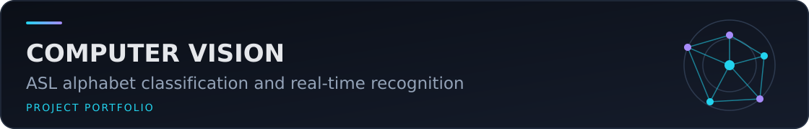

# Sign Language (ASL) to Text Translation (Computer Vision)



Academic computer-vision project for classifying isolated, static American Sign Language alphabet images and displaying predictions from an OpenCV webcam region of interest. The verified scope is 29 image classes—A–Z, `del`, `nothing`, and `space`—rather than continuous sign-language or sentence translation.

## Published material

- `asl_to_text.ipynb` — cleaned teaching notebook for loading data, defining the CNN, optional evaluation/training, and webcam inference.
- `asl_inference.py` — small command-line entry point that loads the submitted model without training.
- `models/cnn_for_asl_grayscale.h5` — submitted 23.6 MiB trained model.
- [French academic report (PDF)](docs/academic-report-fr.pdf).

The external **ASL Alphabet** dataset is not redistributed. Download it from the [official Kaggle dataset page](https://www.kaggle.com/datasets/grassknoted/asl-alphabet). The submitted local tree contained 86,851 training images and 28 test images. No project presentation or demonstration video was found.

## Model contract and preprocessing

The H5 metadata records Keras 3.13.2. The model accepts `(batch, 200, 200, 1)` grayscale images and returns 29 probabilities. The original preprocessing is intentionally preserved: images are resized or loaded at 200×200, kept as `uint8`, reshaped to one channel, and are **not normalized**.

The output order is:

```text
A, B, C, D, del, E, F, G, H, I, J, K, L, M, N,
nothing, O, P, Q, R, S, space, T, U, V, W, X, Y, Z
```

## Installation

Python 3.11 was used for portfolio verification.

```bash
python -m venv .venv
# Windows: .venv\Scripts\activate
# Linux/macOS: source .venv/bin/activate
python -m pip install -r requirements.txt
```

The pinned, verified model-loading stack is TensorFlow 2.20.0 with Keras 3.13.2. TensorFlow/Keras 2.15 cannot deserialize this file because its `InputLayer` configuration contains Keras 3 fields.

## Use the provided model

From the repository root, run a single-image prediction:

```bash
python asl_inference.py --image path/to/a/200x200-or-larger-image.jpg
```

Or open `asl_to_text.ipynb` and run the import, configuration, helper-function, model-loading, and desired inference cells. The default workflow now loads `models/cnn_for_asl_grayscale.h5`; it does not start training.

## Optional evaluation

Place the official test images as follows:

```text
asl_alphabet_test/asl_alphabet_test/*.jpg
```

In the notebook, run the setup/helper cells, load the provided model, then uncomment and execute the optional evaluation cell. Evaluation is separate from both inference and training.

## Optional training

Training requires:

```text
asl_alphabet_train/asl_alphabet_train/<label>/*.jpg
```

Uncomment the optional training cell only when a full training run is intended. It writes `models/cnn_for_asl_grayscale_retrained.h5`; the notebook refuses to use the submitted model path as a training output, so `models/cnn_for_asl_grayscale.h5` is not overwritten.

## Webcam inference

```bash
python asl_inference.py --webcam
```

Place a static sign inside the central 200×200 region and press `q` to exit. Webcam inference was not tested during portfolio preparation because no camera was accessed.

## Results and limitations

The project report evaluates the CNN on the ASL test set and reports:

- **Accuracy:** `92.86%`
- **Loss:** `11.27`
- **29 output classes:** the alphabet plus `del`, `nothing` and `space`
- Real-time webcam recognition through OpenCV

The qualitative tests presented in the report show real-time predictions for the alphabet and the three special classes.

The limitations identified in the report are the quality and diversity of the images, confusion between visually similar gestures, additional processing time on less powerful machines, and the absence of data augmentation. Proposed improvements include data augmentation, deeper or pre-trained models, extension toward multiple hands and complete phrases, and further optimization of real-time inference.

## Authors

- Adam El Akkaoui
- Mohammed Zaidouh
